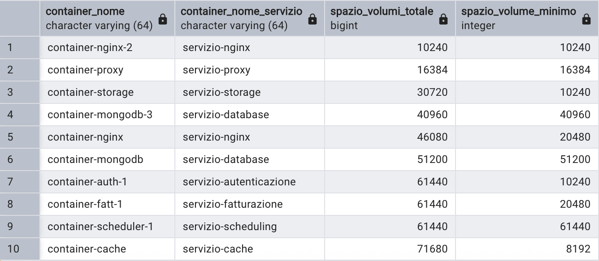
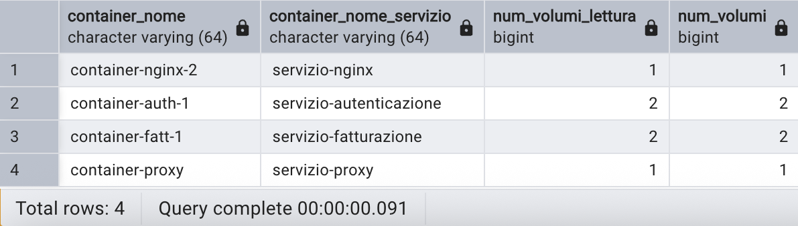

\newpage 

# Abstract
Questo progetto ha lo scopo di realizzare una base di dati per un orchestrator come Docker Swarm.  
Un orchestrator è un software che permette di gestire e coordinare più container Docker in un cluster.  
In un orchestrator ci possono essere **utenti** con diversi privilegi, in questo progetto saranno *admin* e *developer* i ruoli possibili.  
Il primo gestisce la parte infrastrutturale quali i **nodi**, mentre il secondo coordina la creazione di **servizi** e **deployment**.  
I **container** sono l'effettiva entità che eseguono i microservizi, essi risiedono in un **nodo** che può essere qualsiasi macchina con installato Docker, come per esempio una macchina virtuale o un'istanza EC2 su AWS.  
Inoltre i container hanno bisogno di salvare i dati persistenti all'interno dei **volumi**, che possono essere di tre tipi:  

- Il *volume locale* può essere montato su più container, ma sempre nello stesso nodo.
- Il *volume globale* è localizzato in un server remoto, come per esempio un NAS
- Il *volume distribuito* è distribuito su più nodi così da poter essere montato su container con nodi diversi tra di loro, ovviamente necessita di forte sincronizzazione tra i nodi e che l'effettivo container a cui viene montato il volume sia in uno dei nodi in cui è allocata una distribuzione del volume.

Il developer ha il compito di creare **servizi** e **deployment**, dove i servizi sono un insieme di container replicati su più nodi e i deployment sono un insieme di servizi che rappresentano il rilascio di una nuova versione dell'applicativo.  
L'obiettivo è garantire una gestione efficiente e organizzata delle informazioni così da rendere la gestione dei microservizi e del loro versionamento il più semplice possibile.  

# Analisi dei requisiti
Questa sezione descrive i requisiti funzionali della base di dati dell'orchestrator.  

- **Utenti**: ogni utente è identificato da uno *username* ed ha il ruolo di gestire tutta l'infrastruttua dell'orchestrator.  
Contengono le seguenti informazioni:  

  - *username*: stringa univoca che identifica l'utente
  - *password*: password dell'utente a cui verrà applicata una funzione di hashing prima dell'inserimento nel database

Gli utenti possono essere di due tipi: **admin** e **developer**  

- **Utenti admin**: hanno il compito di creare e gestire nodi, quindi la parte infrastrutturale dell'orchestrator.
  
- **Utenti developer**: hanno il compito di creare e gestire servizi e deployment, quindi la parte applicativa dell'orchestrator, inoltre contiene un attributo in più rispetto ad admin.
  - *anzianità*: stringa che rappresenta l'anzianità del developer, come per esempio "junior", "senior" o "lead".
  
- **Nodi**: sono le macchine fisiche o virtuali che eseguono i container Docker.  
Contengono le seguenti informazioni:
    - *hostname*: stringa univoca che identifica il nodo e viene utilizzata per accederci via rete
    - *ip*: indirizzo IP del nodo
    - *sistema operativo*: sistema operativo del nodo
    - *stato*: stato del nodo (Ready, Down, Drain)  

    I nodi possono avere allocati diversi tipi di volumi (locale e distribuito) e oltre ad essere gestiti da un admin, possono contenere più container Docker.  
- **Container**:  sono le entità che eseguono i microservizi e fanno parte di un servizio all'interno di un nodo.  
Contengono le seguenti informazioni:
    - *nome*: stringa che insieme al servizio padre identifica il container
    - *stato*: stato del container che può essere Running, Paused, Created, Dead  

I container possono montare più volumi che però sono allocati su un nodo, il container monta solo volumi che sono presenti nel nodo in cui il container è ospitato, almeno che il volume non sia di tipo globale, in quel caso il volume è allocato su un server esterno.  
Container di diversi servizi possono avere lo stesso nome perchè sono identificati dal nome e dal servizio padre.
Inoltre i container possono accedere a path limitati e con permessi differenti, come per esempio lettura, scrittura ed esecuzione.  

- **Volumi**: sono le entità che permettono di salvare dati persistenti dei container Docker.  
Contengono le seguenti informazioni:
    - *nome*: nome che identifica il volume
    - *dimensione*: numero che rappresenta la dimensione del volume in termini di spazio in KB
    - *path fisico*: stringa che rappresenta il path fisico del volume all'interno del nodo  
I volumi possono essere di tre tipi: **locale**, **globale** e **distribuito**.
- **Volume locale**: è un volume che può essere allocato solo su un nodo e può essere condiviso da più container dello stesso nodo
- **Volume globale**: è un volume centralizzato che può essere allocato su un server esterno e può essere condiviso da più container di nodi diversi senza la necessità che il nodo padre abbia il volume allocato.  
Necessita dell'indirizzo IP del server remoto così da poterlo raggiungere.
- **Volume distribuito**: è un volume che può essere allocato su più nodi e può essere condiviso da più container di nodi diversi che hanno una distribuzione del volume
- **Servizi**: sono un astrazione che rappresenta un insieme di container replicati su più nodi.  
Contengono le seguenti informazioni:
    - *nome*: titolo del servizio che lo identifica
    - *immagine*: immagine Docker da cui verranno creati i container
    - *numero repliche*: numero che rappresenta il numero di repliche del servizio  
I servizi sono creati e gestiti da un developer, il quale può creare più servizi con diverso nome.  
I servizi hanno più container associati (le "repliche"), potenzialmente anche sullo stesso nodo.  
- **Deployment**: sono un astrazione che rappresenta un insieme di servizi che vengono rilasciati in una nuova versione dell'applicativo.  
Contengono le seguenti informazioni:
    - *nome*: nome che dà contesto al deployment
    - *ambiente*: ambiente in cui viene eseguito il deployment (sviluppo, test, produzione)
    - *esito*: esito del deployment (success, running, failed)
    - *numero servizi*: numero di servizi che lo compongono  
I deployment sono identificati da il nome e l'ambiente in cui vengono eseguiti, così da avere lo stesso nome in ambienti diversi (esempio: ecommerce-dev, ecommerce-prod).
Il deployment ha associato più servizi e può essere creato solo da un developer.  
Inoltre è possibile creare uno storico dei deployment, quindi quando si crea un nuovo deployment il precedente viene associato a quello nuovo come "padre".

# Progettazione concettuale
  

Come da analisi dei requisiti, l'utente è l'entità che amministra l'orchestrato, ha un proprio username e password, e può essere di due tipi: **admin** e **developer**.  
Perciò c'è la necessità di creare una generalizzazione dell'entità *Utente* in *Admin* e *Developer*, in modo da poter gestire i diversi privilegi, relazioni e attributi.
I developer possono creare **deployment** e **servizi**, questo porta all'associazione 1 a N, invece l'admin può creare solo **nodi**, portando anch'essa ad una associazione 1 a N.  
Sia developer che admin non sono obbligati a creare deployment, servizi o nodi, però essi sono obbligati ad avere associato un admin o un developer in base al contesto.  

Per quanto riguarda **servizi** e **deployment**, la traduzione dall'analisi dei requisiti avviene in modo abbastanza diretto.  
Un **servizio**, identificato da un proprio nome, può essere parte di uno o più deployment, mentre un deployment, che è per definizione un insieme di servizi, deve contenere almeno uno di essi (non è possibile effettuare deployment "vuoti").  
Di ciascun deployment è anche possibile memorizzare la versione precedente, questo porta ad una relazione ricorsiva 1 a 1 in cui un deployment non è obbligato ad avere una versione precedente o successiva.  
Inoltre non è necessario che la creazione del deployment che contiene un servizio sia effettuato dallo stesso utente che ha creato il servizio stesso.  

Vi è poi la gestione della struttura infrastrutturale del cluster, che comprende **nodi, container e volumi**, a cui spetta il compito di far funzionare i servizi.  
Sulla relazione **container-servizi**, è fondamentale che un servizio abbia almeno un container per essere effettivamente eseguito, e che un container sia parte di uno e un solo servizio, non si prevedono container "orfani", ovvero che non fanno parte di nessun servizio.  
Ciascun **container** può montare diversi **volumi**, utilizzati come file system, e un **volume** può anche essere condiviso tra più container.  
Ciascun volume è visto da un container con un percorso di montaggio e ciascun container dispone di più permessi specifici su ognuno dei suoi volumi.  
I volumi, anche se condivisi da più container, dispongono di un proprio percorso fisico ed è di interesse memorizzarne la dimensione (in KB).  
Ad esempio, un volume $A$ di qualsiasi tipo, con percorso '<u>/volumes/A</u>', può essere montato a due diversi container: il container $C_1$, che lo vede con il percorso '<u>/var/files</u>' e su cui dispone di tutti i permessi, e il container $C_2$, che lo vede con percorso '<u>/data/read</u>', a cui può accedere in sola lettura. Dunque se $C_1$ vuole accedere al file fisico '<u>/volumes/A</u>/net/hosts.txt' lo potrà fare con il percorso '<u>/var/files</u>/net/hosts.txt'.  
Inoltre ci possono essere diversi tipi di volume: **locale**, **globale** e **distribuito**.  
Perciò abbiamo bisogno di una generalizzazione dell'entità *Volume* in *VolumeLocale*, *VolumeGlobale* e *VolumeDistribuito*, dato che essi hanno relazioni e attributi diversi tra di loro.  
Mentre un **volume locale** può essere allocato ad un solo nodo, i **volumi distribuiti** possono essere allocati su più nodi ed essere montati su tutti i container contenenti una sua distribuzione nel nodo in cui il container è ospitato.  
I **volumi globali**, a differenza degli altri due tipi, non sono allocati a nessun nodo, e sono accessibili da tutti i container con un proprio indirizzo IP, che va quindi memorizzato.  
Un qualsiasi volume può anche non essere associato a nessun container, ma è comunque allocato in un nodo.  
Questi vincoli portano ad una associazione N a N tra **container** e **volumi** con i relativi attributi *path montaggio* e *permessi*, mentre **volume locale** e **volume distribuito** hanno rispettivamente una associazione 1 a N e N a N con **nodi**, dato che un volume distribuito come già specificato deve avere una o più distribuzioni su più nodi, mentre un volume locale deve essere allocato in un solo nodo.  

Vi sono infine i **nodi**, che costituiscono l'unità fondamentale del cluster.  
I **nodi** possono ospitare più **container** e più **volumi**, tuttavia un nodo può anche essere privo di container e volumi, questo giustifica la cardinalità (0,N) tra **nodi** e **container** e tra **nodi** e **volumi**(locali e distribuiti).
Dall'altra parte, un container è necessariamente ospitato in uno e un solo nodo.  
Ciascun **nodo** è identificato da un proprio hostname univoco, e può trovarsi in tre stati: "Up", "Down" e "Drain".  

Il diagramma ER non permette di rappresentare i seguente vincoli che si evincono dall'analisi dei requisiti:  

- un volume può essere associato a un container e allocato in un nodo solo se il nodo padre del container è lo stesso in cui è allocato il volume.  
Sia $V$ l'insieme dei Volumi, $C$ l'insieme dei Container e $N$ l'insieme dei Nodi, allora:
$$
\forall v \in V \backslash \{\text{volumi globali}\}, c \in C, n \in N: v \in Montaggi(c), n \in Allocazioni(v) \Rightarrow n \in Ospitazioni(c)
$$  

- un deployment può avere come versione precedente qualsiasi deployment, eccetto se stesso e un deployment che ha come versione precedente una versiona successiva ad esso.  
Sia $D$ l'insieme dei Deployment, allora:

$$ \forall d' \in D, \exists p \in D, \exists d \in D: d' \in VersioniPrecedenti(d') \vee $$
$$ (d \in VersioniPrecedenti(d') \land d' \in VersioniPrecedenti(p) \land p \in VersioniPrecedenti(d)) \Rightarrow d' \notin D $$


# Progettazione logica
Questa sezione descrive la progettazione logica dato lo schema concettuale sviluppato nella sezione precedente, con lo scopo di analizzare le ridondanze ed eliminare le generalizzazioni.  

## Tabella Entità-Relazioni  

### Tabella delle entità  

| Entità | Descrizione | Attributi | Identificatore |
|-----------|-----------|-----------|-----------|
| Utente | Utente che gestisce l'orchestrator | *Username, Password* | *Username* |
| Developer | Utente che gestisce i servizi e i deployment | Anzianità |  |
| Admin | Utente che gestisce i nodi | |  |
| Nodo | Macchina fisica o virtuale che esegue i container Docker | *Hostname, Indirizzo IP, OS, Stato* | *Hostname* |
| Container | Entità che esegue i microservizi | *Nome, Stato* | *Nome, NomeServizio* |
| Volume | Entità che permette di salvare dati persistenti | *Nome, Dimensione, PathFisico* | *Nome* |
| VolumeLocale | Volume allocato in un nodo | | |
| VolumeGlobale | Volume allocato in un server remoto | *IndirizzoIPServer* | |
| VolumeDistribuito | Volume allocato su più nodi | | |
| Servizio | Astrazione che rappresenta un insieme di container replicati su più nodi | *Nome, Immagine, NumeroRepliche* | *Nome* |
| Deployment | Astrazione che rappresenta un insieme di servizi rilasciati in una nuova versione dell'applicativo | *Nome, Ambiente, Esito, NumeroServizi* | *Nome, Ambiente* |

### Tabella delle relazioni  

| Relazione | Descrizione | Componente | Attributi |
|-----------|-----------|-----------|-----------|
| Sviluppo | Sviluppo servizio da parte di un developer | Developer, Servizio | |
| Associazione | Associazione tra più servizi e più deployment | Servizio, Deployment | |
| Produzione | Produzione deployment da parte di un developer | Developer, Deployment | |
| Creazione | Creazione nodo da parte di un admin | Admin, Nodo | |
| Ospitazione | Ospitazione di più container in un nodo | Nodo, Container | |
| Part-of | I container sono parte di un servizio | Servizio, Container | |
| Montaggio | Associazione tra più container e più volumi | Container, Volume | *PathMontaggio, Permessi* |
| Allocazione distribuita | Allocazione volume distribuito su più nodi | VolumeDistribuito, Nodo | |
| Allocazione locale | Allocazione volume locale in un nodo | VolumeLocale, Nodo | |
| Versione precedente | Associazione deployment alla sua versione precedente | Deployment, Deployment | |

## Ristrutturazione attributi multipli  

Nello schema concettuale si nota che nella relazione *Montaggio* è presente un attributo *permessi* che rappresenta i permessi di accesso al volume montato sul container e ai file contenuti.  
Questo attributo potrebbe essere ristrutturato come tabella a parte, tuttavia in Linux i permessi vengono espressi come stringa perciò non c'è necessità di ristrutturarlo.  
I permessi possibili sono *read*('r'), *write*('w') e *execute*('x'), un volume che vuole avere tutti e tre i permessi avrà come stringa 'rwx', mentre un volume che vuole avere solo il permesso di lettura avrà come stringa 'r--'.

## Analisi delle ridondanze  

Nello schema concettuale sono presenti due ridondanze da analizzare:  

- **Numero Repliche**, in *Servizio*, rappresenta il numero di container replicati su più nodi, che può essere ottenuti contando i container con lo stesso servizio.  
Questo attributo viene modificato ogni volta che si vuole aumentare/diminuire il numero di repliche o quando un container viene creato o eliminato.  
Lo scopo di un Orchestrator è tutelare i servizi con variazione dei requisiti molto rapida, perciò si ipotizza uno Swarm Docker con 50 servizi attivi e 20 repliche per servizio di media, ovvero 1000 container attivi.  
Sempre ipotizzando una media di 10 modifiche per ogni servizio al giorno, l'attributo **Numero Repliche** viene modificato in media 500 volte al giorno e viene visualizzato in media 20 volte al giorno per ogni servizio, ovvero 1000 volte al giorno.  
  - **Operazione 1** (500 al giorno): crea o elimina nuovo container associato ad un servizio, così aumentando o diminuendo il numero di repliche
  - **Operazione 2** (1000 al giorno): visualizza il numero di repliche di un servizio

  I volumi della base di dati:  
  
  | Entità | Costrutto | Volume |
  |:-----------:|:-----------:|:-----------:|
  | Container  | E | 1000 |
  | Servizio | E | 50  |

  - **CON RIDONDANZA**
    - Operazione 1:

      | Entità | Costrutto | Accessi | Tipo | Numero Operazioni |
      |:-----------:|:-----------:|:-----------:|:-----------:|:-----------:|
      | Container  | E | 1 | S | 500|
      | Part-of  | R | 1 | S | 500|
      | Ospitazione | R | 1 | S | 500|
      | Servizio | E | 1  | L | 500|
      | Servizio | E | 1  | S | 500|

    - Operazione 2:

      | Entità | Costrutto | Accessi | Tipo | Numero Operazioni |
      |:-----------:|:-----------:|:-----------:|:-----------:|:-----------:|
      | Servizio | E | 1  | L | 1000|

    Assumendo costo doppio per gli accessi in scrittura:
    $$ \text{CostoTotale}_{ConRidondanza} = (500 \cdot 2) \cdot 4 + 500 + 1000 = 5500$$

  - **SENZA RIDONDANZA**  
    - Operazione 1:  

      | Entità | Costrutto | Accessi | Tipo | Numero Operazioni |
      |:-----------:|:-----------:|:-----------:|:-----------:|:-----------:|
      | Container  | E | 1 | S | 500|
      | Part-of  | R | 1 | S | 500|
      | Ospitazione | R | 1 | S | 500|

    - Operazione 2, dove si assume l'ipotesi di 20 repliche medie per servizio:

      | Entità | Costrutto | Accessi | Tipo | Numero Operazioni |
      |:-----------:|:-----------:|:-----------:|:-----------:|:-----------:|
      | Servizio | E | 1  | L | 1000|
      | Part-of | R | 20 | L | 1000|
    Assumendo costo doppio per gli accessi in scrittura:
    $$ \text{CostoTotale}_{SenzaRidondanza} = (500 \cdot 2) \cdot 3 + 1000 + 1000 \cdot 20 = 24000 $$

  L'analisi suggerisce che l'attributo **Numero Repliche** è necessario, in quanto il costo totale con ridondanza è 4 volte inferiore rispetto al costo totale senza ridondanza e considerando l'alto volume di accessi sia in lettura che in scrittura risulta fondamentale mantenere l'attributo.  

- **Numero Servizi**, in *Deployment*, rappresenta il numero di servizi associati ad un deployment, che può essere ottenuto contando i servizi con lo stesso deployment.  
Questo attributo tende a non essere modificato dato che si preferisce crearne un nuovo deployment piuttosto di modificarne uno già esistente per favorire il versionamento dei deployment.  
Ciò accade perchè c'è una forte necessità di fare rollback in caso il deployment fallisca o abbia dei bug nell'ambiente in cui è stato fatto.  
Si utilizzano le stesse ipotesi dell'analisi precedente, ovvero 50 servizi attivi e 20 repliche per servizio di media.  
Inoltre si consideri la creazione, in media, di 3 deployment al giorno (dev, test e produzione) con 50 servizi per deployment, quindi in totale ipotizziamo 1000 deployment come volume.  
  - **Operazione 1** (3 al giorno): memorizza un nuovo deployment associato a più servizi
  - **Operazione 2** (6 volte al giorno): visualizza il numero di servizi di un deployment prima di crearne uno nuovo e dopo averlo creato

  Come già precisato, si specificano i volumi della base di dati:  
  
  | Entità | Costrutto | Volume |
  |:-----------:|:-----------:|:-----------:|
  | Deployment  | E | 1000 |
  | Servizio | E | 50 |

  - **CON RIDONDANZA**
    - Operazione 1:

      | Entità | Costrutto | Accessi | Tipo | Numero Operazioni |
      |:-----------:|:-----------:|:-----------:|:-----------:|:-----------:|
      | Deployment  | E | 1 | S | 3 |
      | Produzione  | R | 1 | S | 3 |
      | Associazione  | R | 1 | S | 50 |

    - Operazione 2:

      | Entità | Costrutto | Accessi | Tipo | Numero Operazioni |
      |:-----------:|:-----------:|:-----------:|:-----------:|:-----------:|
      | Deployment | E | 1  | L | 6 |

    Assumendo costo doppio per gli accessi in scrittura:
    $$ \text{CostoTotale}_{ConRidondanza} = (3 \cdot 2) + (3 \cdot 2) + (50 \cdot 2) + 6 =  118 $$

  - **SENZA RIDONDANZA**
    - Operazione 1:  

      | Entità | Costrutto | Accessi | Tipo | Numero Operazioni |
      |:-----------:|:-----------:|:-----------:|:-----------:|:-----------:|
      | Deployment  | E | 1 | S | 3 |
      | Produzione  | R | 1 | S | 3 |
      | Associazione  | R | 1 | S | 50 |
    - Operazione 2:

      | Entità | Costrutto | Accessi | Tipo | Numero Operazioni |
      |:-----------:|:-----------:|:-----------:|:-----------:|:-----------:|
      | Deployment | E | 1 | L | 6 |
      | Servizio | E | 50 | L | 6 |
    Assumendo costo doppio per gli accessi in scrittura:
    $$ \text{CostoTotale}_{SenzaRidondanza} = (3 \cdot 2) + (3 \cdot 2) + (50 \cdot 2) + 6 + (50\cdot6) = 418 $$

  L'analisi suggerisce che l'attributo **Numero servizi** è utile, in quanto il costo totale con ridondanze è circa 3 volte inferiore, tuttavia anche l'ipotesi di rimuoverlo sarebbe valida dato il numero di accessi è in termini assoluti molto basso.  
  Si sceglie di mantenerlo per semplificare le query ed evitare il calcolo del numero di servizi associati ad un deployment, tuttavia è fondamentale mantenere la consistenza del numero di servizi salvato nel deployment.  
  Inoltre è chiaro che l'analisi di questa ridondanza favorisce il mantenimento dell'attributo, dato che non si considera l'analisi dal punto di vista dell'aggiunta di un servizio con associazione ad un deployment, tuttavia quella determinata operazione non è comune nel contesto descritto.

Nello schema concettuale non sono presenti relazioni ridondanti, in quanto ogni relazione ha un significato ben preciso e non è possibile accorparle senza perdere informazioni.  
Si potrebbe pensare all'eliminazione della relazione *AllocazioneLocale*, ma è fondamentale perchè un volume locale può anche non essere montato su nessun container.  

## Eliminazione delle generalizzazioni
Le generalizzazioni descritte nello schema concettuale vengono ristrutturate con l'obiettivo di eliminare le ridondanze e semplificare il modello relazionale.  
Le due entità coinvolte sono:  

- **Utente**: la generalizzazione di Utente in *Developer* e *Admin* è necessaria per la distinzione dei privilegi per tipo di utente, in quanto i due tipi di utente hanno relazioni totalmente diverse tra di loro e developer ha un attributo in più rispetto ad admin.  
Perciò si decide di partizionare l'entità *Utente* nelle specializzazioni *Developer* e *Admin* con lo scopo di mantenere i vincoli relativi ai loro ruoli, ovvero che un developer non può creare nodi e un admin non può creare servizi e deployment.  
Questa scelta aumenta il numero di tabelle, ma oltre a mantenere i vincoli precedentemente descritti, riduce al minimo i valori nulli e non richiede l'aggiunta dell'attributo *Ruolo*.  

- **Volume**: la generalizzazione di Volume in *Volume Locale*, *Globale* e *Distribuito* è necessaria per la distinzione logica dei volumi, in quanto i tre tipi di volume hanno relazioni e attributi diversi tra di loro.  
Perciò si decide di partizionare l'entità *Volume* in *VolumeLocale*, *VolumeGlobale* e *VolumeDistribuito* con lo scopo di separare i volumi in base alla loro tipologia e mantenere i vincoli relativi alla loro allocazione.  
Questa scelta aumenta il numero di tabelle, ma rende possibile l'implementazione di attributi e relazioni specifiche per ogni tipo di volume, inoltre riduce al minimo il numero di valori nulli.  
Nel caso si fosse deciso di accorpare le tre specializzazioni in un'unica entità sarebbe stato molto complesso implementare le relazioni specifiche per ogni tipo di volume, inoltre l'attributo *IndirizzoIPServer* sarebbe stato nullo per i volumi locali e distribuiti, rendendo l'entità meno efficiente.  

  

## Schema relazionale  

- **Developers**(<u>username</u>, password, anzianità)
- **Admins**(<u>username</u>, password)
- **Servizi**(<u>nome</u>, immagine, num_repliche, username_developer)
  - Servizi.username_developer $→$ Developers.username
- **Deployments**(<u>nome, ambiente</u>, esito, num_servizi, username_developer, versione_precedente)
  - Deployments.username_developer $→$ Developers.username
  - Deployments.versione_precedente $→$ Deployments.nome
- **ServiziDeployed**(<u>nome_servizio, nome_deployment, ambiente_deployment</u>)
  - ServiziDeployed.nome_servizio $→$ Servizi.nome
  - ServiziDeployed.(nome_deployment, ambiente_deployment) $→$ Deployments.(nome, ambiente)
- **Nodi**(<u>hostname</u>, indirizzo_IP, stato, sistema_operativo, username_admin)
  - Nodi.username_admin $→$ Admins.username
- **Containers**(<u>nome, nome_servizio</u>, stato, hostname_nodo)
  - Containers.nome_servizio $→$ Servizi.nome
  - Containers.hostname_nodo $→$ Nodi.hostname
- **VolumiLocali**(<u>nome</u>, dimensione, path_fisico, hostname_nodo)
  - VolumiLocali.hostname_nodo $→$ Nodi.hostname
- **VolumiGlobali**(<u>nome</u>, dimensione, path_fisico, indirizzo_IP_server)
- **VolumiDistribuiti**(<u>nome</u>, dimensione, path_fisico)
- **MontaggiLocali**(<u>container_nome, container_nome_servizio, nome_volume</u>, path_montaggio, permessi)
  - MontaggiLocali.(container_nome, container_nome_servizio) $→$ Containers.(nome, nome_servizio)
  - MontaggiLocali.nome_volume $→$ VolumiLocali.nome
- **MontaggiGlobali**(<u>container_nome, container_nome_servizio, nome_volume</u>, path_montaggio, permessi)
  - MontaggiGlobali.(container_nome, container_nome_servizio) $→$ Containers.(nome, nome_servizio)
  - MontaggiGlobali.nome_volume $→$ VolumiGlobali.nome
- **MontaggiDistribuiti**(<u>container_nome, container_nome__servizio, nome_volume</u>, path_montaggio, permessi)
  - MontaggiDistribuiti.(container_nome, container_nome_servizio) $→$ Containers.(nome, nome_servizio)
  - MontaggiDistribuiti.nome_volume $→$ VolumiDistribuiti.nome
- **AllocazioniDistribuite**(<u>hostname_nodo, nome_volume</u>)
  - AllocazioniDistribuite.hostname_nodo $→$ Nodi.hostname
  - AllocazioniDistribuite.nome_volume $→$ VolumiDistribuiti.nome


# Implementazione in PostgreSQL e definizione delle query
Il file `orchestrator-db.sql` contiene il codice SQL necessario alla creazione e il popolamento delle tabelle del database, inoltre è presente un trigger che permette di far rispettare il primo vincolo di integrità referenziale, specificato nella progettazione concettuale.  
Infine contiene il codice SQL delle query e degli indici che saranno spiegati in seguito con i relativi risultati.

## Definizione delle query  

### Query 1  

Trovare i developer che hanno sviluppato dei servizi, poi associati ad un deployment, in almeno un numero di ambienti specifico (es. 2).
```sql
SELECT s.username_developer AS nome_servizio, 
COUNT(DISTINCT sd.ambiente_deployment) AS num_ambienti
FROM ServiziDeployed sd
JOIN Servizi s ON sd.nome_servizio = s.nome
GROUP BY s.username_developer
HAVING COUNT(DISTINCT sd.ambiente_deployment) >= 2;
```
{ width=50% }

### Query 2  

Trovare i developer con un grado di anzianità specifico, almeno un deployment in uno stato specifico (es. failed) e con media di servizi deployed maggiore di una determinata soglia (es. 2).  
Inoltre ordinarli per numero di deployment in quel determinato stato e per media di servizi deployed, entrambi in ordine decrescente.  
```sql
SELECT dep.username_developer, COUNT(*) AS num_failed_deployments, 
ROUND(AVG(num_servizi), 2) AS media_servizi_deployed
FROM Deployments dep
JOIN Developers dev  
ON dep.username_developer = dev.username
WHERE dev.anzianita = 'senior' AND dep.esito = 'failed'
GROUP BY dep.username_developer
HAVING AVG(dep.num_servizi) > 2
ORDER BY COUNT(*) DESC, AVG(dep.num_servizi) DESC;
```
{ width=50% }

### Query 3  

Trovare i container ordinati per spazio disponibile in ordine crescente e il volume più piccolo per ogni container sempre in ordine crescente.  
```sql
CREATE VIEW Montaggi AS
SELECT MontaggiLocali.*, VolumiLocali.dimensione
FROM MontaggiLocali
JOIN VolumiLocali ON VolumiLocali.nome = MontaggiLocali.nome_volume
UNION ALL
SELECT MontaggiGlobali.*, VolumiGlobali.dimensione
FROM MontaggiGlobali
JOIN VolumiGlobali ON VolumiGlobali.nome = MontaggiGlobali.nome_volume
UNION ALL
SELECT MontaggiDistribuiti.*, VolumiDistribuiti.dimensione
FROM MontaggiDistribuiti
JOIN VolumiDistribuiti ON VolumiDistribuiti.nome = MontaggiDistribuiti.nome_volume;

SELECT container_nome, container_nome_servizio, 
SUM(dimensione) AS spazio_volumi_totale, 
MIN(dimensione) AS spazio_volume_minimo
FROM Montaggi
GROUP BY container_nome, container_nome_servizio
ORDER BY spazio_volumi_totale ASC, spazio_volume_minimo ASC;
```
{ width=50% }

### Query 4  

Trovare i container che sono in sola lettura su tutti i volumi montati.  
```sql
CREATE VIEW VolumiInLetturaPerContainer AS
SELECT container_nome, container_nome_servizio, COUNT(*) AS num_volumi_lettura
FROM Montaggi
WHERE permessi = 'r--'
GROUP BY container_nome, container_nome_servizio;

CREATE VIEW VolumiPerContainer AS
SELECT container_nome, container_nome_servizio, COUNT(*) AS num_volumi
FROM Montaggi
GROUP BY container_nome, container_nome_servizio;

SELECT vpc.container_nome, vpc.container_nome_servizio, vlpc.num_volumi_lettura
FROM VolumiPerContainer vpc
JOIN VolumiInLetturaPerContainer vlpc
ON vlpc.container_nome = vpc.container_nome
AND vlpc.container_nome_servizio = vpc.container_nome_servizio
WHERE vlpc.num_volumi_lettura = vpc.num_volumi;
```
{ width=50% }

### Query 5  

Trovare il nodo o i nodi che se cadessero danneggerebbero più servizi, inoltre associare l'admin responsabile del nodo.  
```sql
SELECT Containers.hostname_nodo, 
COUNT(DISTINCT nome_servizio) AS num_servizi, Nodi.username_admin
FROM Containers
JOIN Nodi ON Nodi.hostname = Containers.hostname_nodo
GROUP BY Containers.hostname_nodo, Nodi.username_admin
HAVING COUNT(DISTINCT nome_servizio) >= ALL(
    SELECT COUNT(DISTINCT nome_servizio)
    FROM Containers
    GROUP BY Containers.hostname_nodo
)
ORDER BY num_servizi ASC, Nodi.username_admin ASC;
```
{ width=50% }

## Creazione degli indici  
Si vogliono ottimizzare le query create in precedenza attraverso l'utilizzo di indici.
Si scelgono la **query 2** e la **query 5**:  

- Query 2  
Gli indici inseriti sono di tipo `HASH` così da far accedere le ricerche su `Developers.anzianita` e `Deployments.esito` in tempo `O(1)`.  
Ciò permette di ottimizzare la ricerca dei developers e dei deployments filtrati per anzianità e esito, in quanto c'è un `WHERE` sulla colonna `anzianita` e `esito` che filtra i risultati.   
```sql
CREATE INDEX AnzianitaDevelopers
ON Developers
USING HASH ( anzianita );

CREATE INDEX EsitoDeployments
ON Deployments
USING HASH ( esito );
```

- Query 5  
Si era ipotizzato di creare un indice *B-tree* sul campo `dimensione` per ottimizzare la query 3, più specificatamente la funzione di aggregazione `MIN(dimensione)`, così da velocizzarla essendo il minimo il nodo più a sinistra del balanced tree.  
Tuttavia la documentazione di PostreSQL non garantisce l'ottimizzazione con le funzioni di aggregazione, ma solo con il costrutto `ORDER BY ... LIMIT 1`.  
La query 3 cerca la dimensione minima del volume per ogni container, quindi non è possibile utilizzare questo costrutto.
Fonte: [Documentazione PostgreSQL](https://www.postgresql.org/docs/8.0/functions-aggregate.html)  
La documentazione è di una versione non più supportata, ma provando empiricamente e guardando la documentazione di versioni più recenti(che non specifica più il caso), si evince che il comportamento non è cambiato.  

## Applicazione software  

Il file `query.c` contiene il codice C necessario per la connessione e l'esecuzione delle query sul database PostgreSQL, utilizzando la libreria `libpq` per la connessione al database.  
Le query vengono preparate attraverso `PQprepare` ed eseguite con `PQexecPrepared` così da migliorare le performance in caso di esecuzione ripetuta delle stesse query, inoltre sono istanziate nella array di struct `Query` che contiene il nome delle query, il testo delle query e i parametri da passare alle query.  
Le query una volta eseguite vengongo stampate nella console e scritte in un file csv, in base all'input dell'utente dopo aver scelto la query.   
Una volta eseguito il programma vengono stampate le descrizioni delle query con i numeri corrispondenti:  

  0. Per terminare il programma  
  1. Developer che hanno sviluppato dei servizi, poi deployati, in un numero di ambienti maggiore o uguale dell'intero specificato 
  2. Developer con specifica anzianità con associati i numeri di deployment nello stato specificato e la media dei servizi deployed, vengono considerati solo i developer con una media di servizi deployed superiore all'intero specificato  
  3. Container che sono in sola lettura su tutti i volumi  
  4. Il nodo o i nodi che se cadessero darebbero problemi a più servizi, viene inserito anche l'admin associato al nodo  
  5. Container ordinati per spazio totale dei volumi montati in ordine crescente e la dimensione del volume più piccolo di quel container  

Le query 1. e 2. sono parametrizzate con un intero per la prima, una stringa e un intero per la seconda query, in modo da poterle eseguire con parametri diversi senza dover modificare il codice.